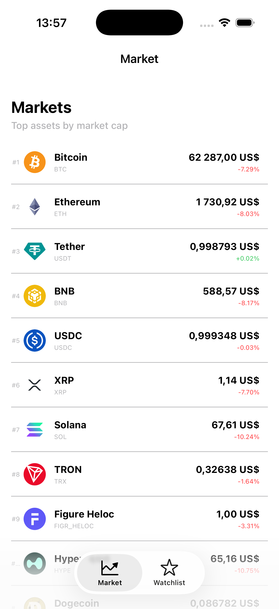
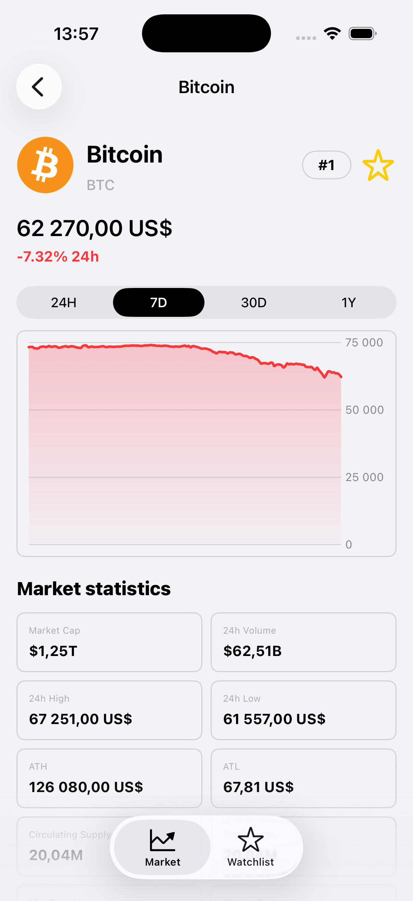
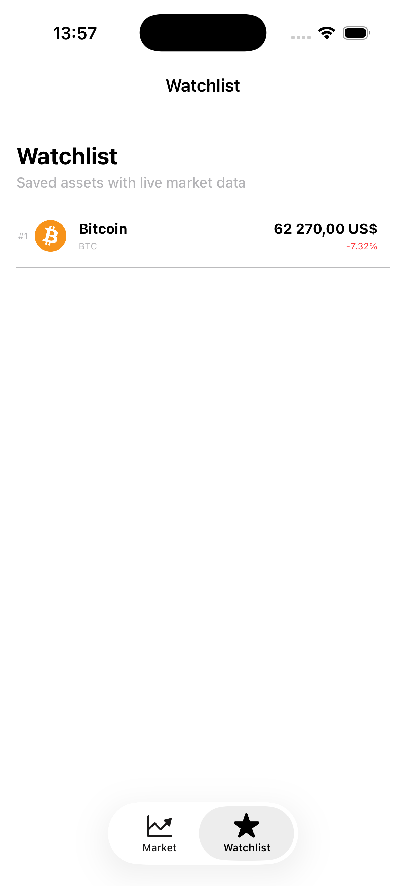
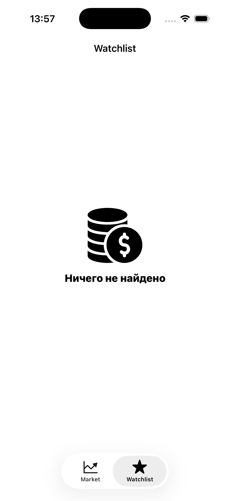
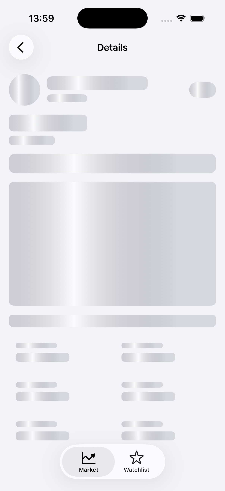

# IMW

IMW - iOS-приложение для просмотра криптовалютного рынка на данных CoinGecko.

Проект сделан не как демонстрация двух экранов, а как компактный пример архитектуры, которую можно поддерживать и расширять: сетевой слой, локальное хранение, загрузка изображений, переиспользуемый UI, DI, координаторы, тесты и CI вынесены в явные зоны ответственности.

## Что есть в приложении

- Экран списка активов с пагинацией и pull-to-refresh.
- Детальный экран актива с ценой, статистикой, ссылками и графиком.
- Watchlist с локальным сохранением выбранных активов.
- Cache-first отображение данных из CoreData.
- Загрузка изображений через отдельный image loading слой.
- Skeleton loading для списка и детального экрана.
- Базовая обработка empty/error/loading состояний.
- Unit-тесты presenter-логики списка.
- GitHub Actions CI для сборки и тестов.

## Скриншоты

<p>
  
  
  
</p>

<p>
  
  
</p>

## Стек

- Swift
- UIKit
- SwiftUI Charts
- async/await
- Swift Package Manager
- CoreData
- URLSession-based networking
- SnapKit
- XCTest
- GitHub Actions

## Архитектура

В app target используется MVP + Coordinator.

Роли разделены так:

- `ViewController` отвечает за UIKit, layout, user events и отображение view model.
- `Presenter` отвечает за состояние экрана, загрузку данных, пагинацию, retry, cancellation и подготовку данных к отображению.
- `Worker` работает с внешними зависимостями: сетью, storage и image loader.
- `Mapper` преобразует API/storage domain-модели во view models.
- `Coordinator` отвечает за навигацию внутри flow.
- `Container` отвечает за создание экранов и скрывает composition logic от координатора.
- `Assembly` создает конкретный модуль и связывает `ViewController`, `Presenter`, `Worker`, `Mapper`.

Цель такого разбиения - оставить экранные классы читаемыми и не смешивать UI, навигацию, сетевые запросы, CoreData и форматирование данных в одном месте.

## Module Containers

Сборка экранов вынесена из координаторов в отдельные container-объекты.

В проекте есть несколько уровней composition:

- `MainCoordinator` создает flow-контейнеры и общий container.
- `MarketContainer` собирает экраны market flow.
- `WatchlistContainer` собирает экраны watchlist flow.
- `CommonModuleContainer` собирает общие экраны, которые используются из разных flow.

Например, detail screen доступен из `Market` и `Watchlist`, но сам модуль собирается в одном месте - `CommonModuleContainer`.

Это убирает дублирование сборки экранов и оставляет координаторы ответственными только за навигацию:

- `MarketCoordinator` не знает, как устроен `MarketDetailAssembly`;
- `WatchlistCoordinator` не дублирует зависимости detail-экрана;
- общие экраны можно переиспользовать между flow без копирования composition-кода.

Внутри модулей входные данные и зависимости разделены:

- `Input` - данные, необходимые конкретному экрану, например asset id;
- `Dependencies` - сервисы и внешние зависимости, например `RESTClientInterface`, `StorageClient`, `ImageLoaderInterface`, routing/coordinator.

Такое разделение делает границы модуля явными: presenter получает только данные своего сценария, а сборка зависимостей остается в assembly/container layer.

## Core-пакеты

Инфраструктура вынесена в отдельные Swift packages:

- `AppCore` - общие utilities: pagination, task box, debouncer, collection helpers, logger.
- `AppNetworkCore` - общий сетевой слой на основе `APIEndpoint`.
- `AppStorageCore` - CoreData/FileStorage abstractions.
- `AppImageCore` - async image loading с cache policy.
- `AppUICore` - переиспользуемые UIKit-компоненты: labels, buttons, table abstraction, haptics, UIView helpers.

App target содержит только продуктовую часть:

- endpoint'ы CoinGecko;
- screen modules;
- storage endpoint'ы конкретных сущностей;
- координаторы;
- app bootstrap.

Такое разделение позволяет переиспользовать инфраструктуру в других проектах и не тащить продуктовые API-вызовы в core-пакеты.

## Структура проекта

```text
IMW
├── Resource
│   ├── AppBootstrapper
│   ├── AppConfiguration
│   └── DependencyContainer
├── Source
│   ├── APIEndpoints
│   ├── BaseUI
│   ├── Coordinator
│   │   ├── CommonModuleContainer
│   │   ├── MarketContainer
│   │   └── WatchlistContainer
│   ├── Scenes
│   │   ├── MarketModule
│   │   │   ├── List
│   │   │   └── Detail
│   │   └── WatchlistModule
│   ├── Shared
│   └── Storage
└── IMWTests
```

## Сетевой слой

Сетевые запросы описываются через `APIEndpoint`.

В app target лежат только конкретные endpoint'ы:

- `MarketListEndpoint`
- `MarketDetailEndpoint`
- `MarketChartEndpoint`

Сам `RESTClient` находится в `AppNetworkCore`.

Плюсы подхода:

- endpoint явно описывает request;
- response type связан с endpoint'ом;
- screen modules не знают деталей сборки URLRequest;
- сетевой слой можно тестировать отдельно от приложения.

## Storage слой

Работа с CoreData построена через `StorageEndpoint`.

Идея такая же, как у API endpoint:

- отдельный тип описывает одну storage-операцию;
- storage client выполняет endpoint;
- worker не знает деталей CoreData-запроса;
- presenter не знает, где и как сохраняются данные.

Примеры:

- `FetchMarketAssetsStorageEndpoint`
- `SaveMarketAssetsStorageEndpoint`
- `FetchMarketDetailStorageEndpoint`
- `SaveMarketChartStorageEndpoint`
- `FetchWatchlistAssetsStorageEndpoint`

Плюсы:

- CoreData изолирована от экранов;
- storage операции проще тестировать;
- логика сохранения не размазана по worker/presenter;
- легко заменить реализацию storage client.

Trade-off:

- для production-уровня нужно добавить uniqueness constraints и миграционную стратегию.

## Cache-first flow

Экраны умеют показывать cached data до прихода свежих данных из сети.

Например, список активов:

1. Presenter запрашивает cached list.
2. Если cache есть, экран отображает его сразу.
3. Параллельно запрашивается fresh network data.
4. После успешного ответа UI обновляется.
5. Новые данные сохраняются в CoreData.

Это улучшает perceived performance и дает пользователю контент быстрее.

Trade-off:

- cache invalidation сейчас простой, без TTL.

## Image loading

Загрузка изображений вынесена в `AppImageCore`.

В ячейках нет сетевой логики. Worker загружает изображения через `ImageLoaderInterface`, presenter собирает словарь изображений и передает готовые `UIImage` во view model.

Для list/watchlist изображения грузятся параллельно через `TaskGroup`.

Ошибки загрузки изображений не блокируют экран:

- пользователь видит placeholder;
- ошибка логируется через `AppLogger` в debug.

Trade-off:

- presenter знает о том, какие изображения нужны экрану;
- зато reusable cell не выполняет скрытую сетевую работу и остается простой.

## Task cancellation

Асинхронные задачи presenter'ов хранятся в `TaskBox`.

Задачи отменяются, когда экран действительно уходит из navigation stack или dismiss'ится. После async-boundary presenter проверяет `Task.isCancelled` перед изменением состояния.

Это защищает от ситуации, когда:

- пользователь ушел с экрана;
- старый запрос завершился позже;
- старый результат пытается обновить UI или state уже неактуального экрана.

## UI

UIKit используется как основа приложения.

SwiftUI используется точечно - для графика через Swift Charts. Граница UIKit/SwiftUI изолирована в detail screen через `UIHostingController`.

Плюсы:

- UIKit остается основным predictable UI layer;
- Swift Charts позволяет не писать график вручную;
- SwiftUI не расползается по проекту.

## Error handling

Ошибки разделены по влиянию на пользователя.

Пользовательские ошибки:

- ошибка загрузки market list;
- ошибка загрузки detail;
- ошибка загрузки chart.

Они показываются через базовый alert с retry.

Нефатальные ошибки:

- ошибка сохранения cache;
- ошибка чтения cache;
- ошибка загрузки отдельной картинки.

Они логируются через `AppLogger`, но не блокируют основной пользовательский сценарий.

Это осознанный trade-off: cache/image errors не должны ломать экран, если основные данные доступны.

## Dependency Injection

`DependencyContainer` хранит shared dependencies:

- `RESTClientInterface`
- `ImageLoaderInterface`
- `FileStorage`
- `StorageClient`

Модули получают зависимости через `Dependencies` models и собираются в assemblies.

Сборка экранов проходит через module containers, а внутри каждого модуля данные экрана и внешние зависимости разделены на `Input` и `Dependencies`.

Такой подход оставляет зависимости явными, не превращает проект в набор singleton'ов и не заставляет координаторы знать детали создания presenter/worker/mapper.

## Тесты

В проекте есть unit-тесты для `MarketListPresenter`.

Покрытые сценарии:

- cached data отображается до network response;
- refresh сбрасывает pagination;
- refresh заменяет cache;
- старые изображения не попадают в новый refresh state;
- pagination не делает лишний запрос после последней страницы;
- повторный refresh/loadNext не стартует новый запрос, пока идет текущая загрузка.

Почему тестируется presenter:

- именно там находится экранная логика;
- presenter не зависит от UIKit rendering;
- worker/mapper/view мокируются;
- тесты проверяют поведение, а не детали UI.

## CI

GitHub Actions выполняет:

- Swift package resolution;
- build приложения;
- unit tests.

В CI сейчас явно запускаются только unit-тесты

Это сделано осознанно: сначала проверяется бизнес-логика и компиляция проекта, UI-тесты можно добавить позже под стабильные пользовательские сценарии.

## Конфигурация API key

Ключ CoinGecko читается из `Info.plist` через build settings.

Локальная настройка:

1. Создать файл `Config/Secrets.xcconfig`.
2. Добавить ключ:

```text
COINGECKO_API_KEY = paste_your_key_here
```

`Config/Secrets.xcconfig` находится в `.gitignore` и не должен попадать в репозиторий.

В репозитории лежит только `Config/Secrets.example.xcconfig` с placeholder-значением.

## Trade-offs и ограничения

Ниже то, что я бы дорабатывал при переводе в production.

- CoreData uniqueness сейчас обеспечивается fetch/update логикой. Для production нужно добавить uniqueness constraints.
- Cache invalidation простой. Нет TTL, stale markers и offline policy.
- Image loading параллельный, но без ограничения количества одновременных задач.
- UI-тесты не включены в CI.
- Форматирование чисел находится в mapper'ах. Для большого продукта лучше вынести formatting service.

## Почему проект сделан именно так

Главная цель - показать не количество экранов, а инженерную структуру.

В проекте есть:

- разделение инфраструктуры и продуктового кода;
- явные зависимости;
- typed endpoints для сети и storage;
- cache-first подход;
- task cancellation;
- reusable UI components;
- тестируемая presenter-логика;
- CI.

При этом проект не превращен в чрезмерно абстрактную архитектурную демонстрацию. Основная бизнес-логика читается в feature modules, а инфраструктура вынесена туда, где ее можно переиспользовать.

Такой подход позволяет добавлять новые экраны, новые endpoint'ы, новые storage операции и новые UI-компоненты без переписывания существующих модулей.
